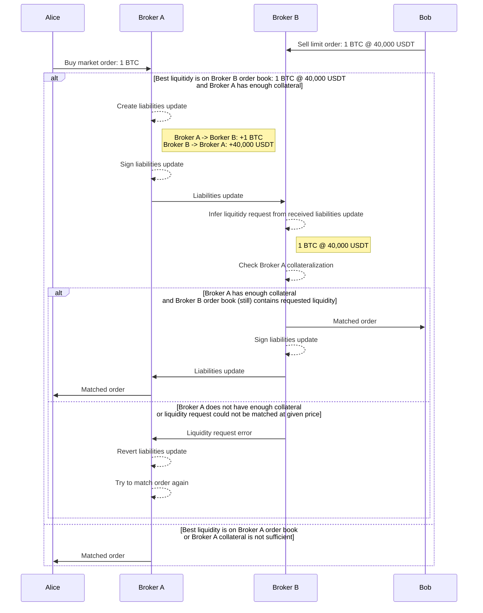
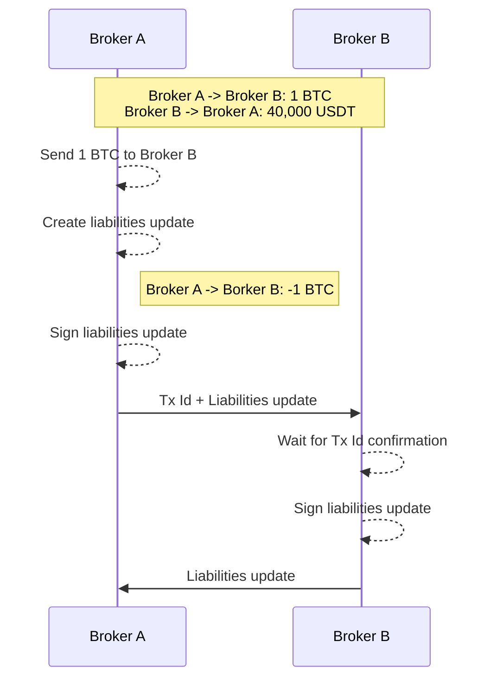

# Liabilities channel

## Trade

### State represenation

```yaml
# Participant liabilities
Participant:
    # Liabilities per asset
    Asset:
        # Liability amount to other participant
        Participant: amount
```

**Note:**  
Here we store particpant liabilities per asset, in order to easily calculate the total amount of liabilities for each asset.  
Allowing us to use this informations for collateralization calculations.

**Example state**:  
```yaml
Broker A:
    BTC:
        Broker B: 1
Broker B:
    USDT:
        Broker A: 40000
```

### Workflow



### Notes

**Interesing concept:**  
One broker could take liquidity from another, without a market order from one of his traders.  
This could be a good technique for said broker to **steal liquidity** from others brokers (to put it on his local order book).  
*Knowing that the liquidity on others brokers is very interesting to take now, compared to current markets conditions.*

## Settlement

### One way



### Dispute resolution

**What happen if receiving broker does not sign the liability update ?**
