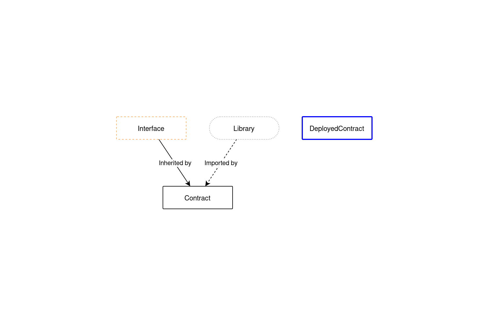
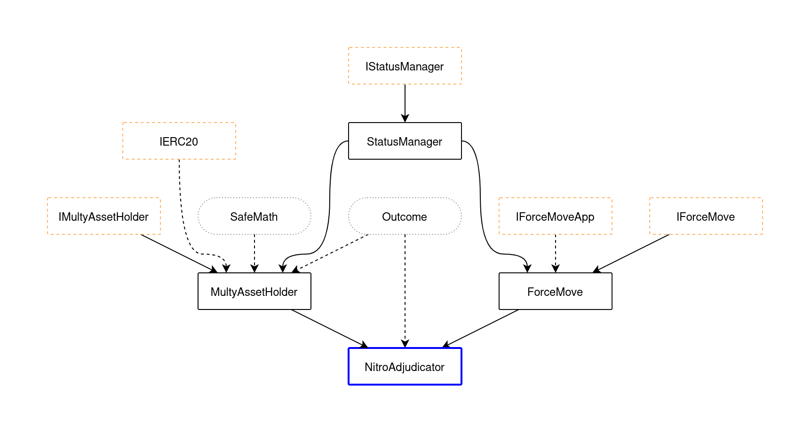
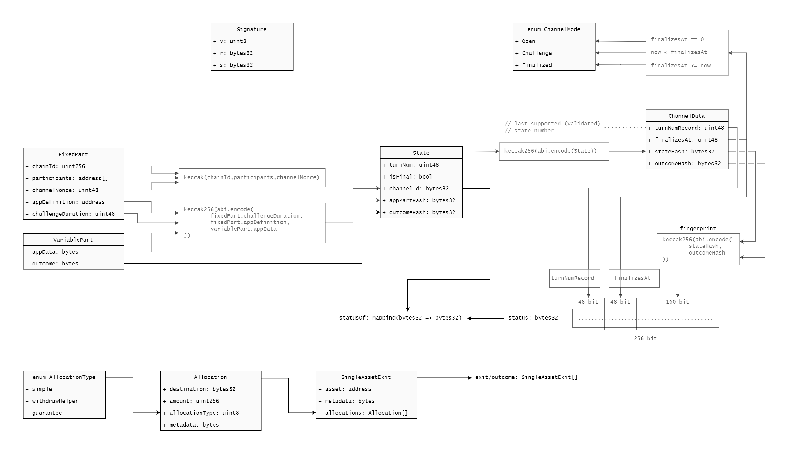

# State channels

## Current version of the protocol

### Philosophy

The main philosophy of current version is that Adjudicator defines all the rules: funding, opening, progressing, concluding a channel, etc and developer's DApp describes the logic of `validTransition` between two states, thus allowing Adjudicator to build chains of valid states which constitute a **Support proof**. In one form or another it is required to checkpoint, challenge, respond or conclude a channel.

### Contract design

`NitroAdjudicator` is a top-level contract, which has to be deployed one per chain to manage and interact with channels. It inherits several more logic-specific contracts, each responsible for different work.

#### Contract inheritance key




#### Contract inheritance schema



### Data structure



### Adjudicator interface

`NitroAdjudicator` exposes a bunch of external methods, including inherited ones, but the most frequently used are:

#### MultiAssetHolder

```solidity
// Deposit ETH or erc20 tokens against a given channelId.
function deposit(
    address asset,
    bytes32 channelId,
    uint256 expectedHeld,
    uint256 amount
)
```

```solidity
// Transfers as many funds escrowed against `channelId` as can be afforded for a specific destination.
function transfer(
    uint256 assetIndex,
    bytes32 fromChannelId,
    bytes memory outcomeBytes,
    bytes32 stateHash,
    uint256[] memory indices
)
```

#### ForceMove

```solidity
// Registers a challenge against a state channel. A challenge will either prompt another participant into clearing the challenge (via one of the other methods), or cause the channel to finalize at a specific time.
function challenge(
    FixedPart memory fixedPart,
    uint48 largestTurnNum,
    IForceMoveApp.VariablePart[] memory variableParts,
    uint8 isFinalCount, // how many of the states are final
    Signature[] memory sigs,
    uint8[] memory whoSignedWhat,
    Signature memory challengerSig
)
```

```solidity
// Responds to an ongoing challenge registered against a state channel.
function respond(
    bool[2] memory isFinalAB,
    FixedPart memory fixedPart,
    IForceMoveApp.VariablePart[2] memory variablePartAB,
    // variablePartAB[0] = challengeVariablePart
    // variablePartAB[1] = responseVariablePart
    Signature memory sig
)
```

```solidity
// Overwrites the `turnNumRecord` stored against a channel by providing a state with higher turn number, supported by a signature from each participant.
function checkpoint(
    FixedPart memory fixedPart,
    uint48 largestTurnNum,
    IForceMoveApp.VariablePart[] memory variableParts,
    uint8 isFinalCount, // how many of the states are final
    Signature[] memory sigs,
    uint8[] memory whoSignedWhat
)
```

```solidity
// Finalizes a channel by providing a finalization proof.
function conclude(
    uint48 largestTurnNum,
    FixedPart memory fixedPart,
    bytes memory appData,
    bytes memory outcome,
    uint8 numStates,
    uint8[] memory whoSignedWhat,
    Signature[] memory sigs
)
```

#### NitroAdjudicator

```solidity
// Finalizes a channel by providing a finalization proof, and liquidates all assets for the channel.
function concludeAndTransferAllAssets(
    uint48 largestTurnNum,
    FixedPart memory fixedPart,
    bytes memory appData,
    bytes memory outcomeBytes,
    uint8 numStates,
    uint8[] memory whoSignedWhat,
)
```

```solidity
// Liquidates all assets for the channel
function transferAllAssets(
    bytes32 channelId,
    bytes memory outcomeBytes,
    bytes32 stateHash
)
```

These 8 methods cover all possible side-effect interactions with a state channel.

> **NOTE**: Separate `sigs` and `whoSignedWhat` arguments may appear like a bad code design, but actually are needed for Adjudicator to decide whether provided states constitute a Support proof. This check happens separately from building a chain of states mentioned earlier, thus coupling sigs with states is not optimal.

### Events

Using events from `NitroAdjudicator`, one can get current status of the channel and other related information.

#### MultiAssetHolder

```solidity
event Deposited(
    bytes32 indexed destination,    // The channel being deposited into
    address asset,                  // The address of asset being deposited (0 means ETH)
    uint256 amountDeposited,        // The amount being deposited
    uint256 destinationHoldings     // The new holdings for `destination`
);
```

---

Indicates the assetOutcome for this channelId and assetIndex has changed due to a transfer or claim. Includes sufficient data to compute:

- the new assetOutcome
- the new holdings for this channelId and any others that were transferred to
- the payouts to external destinations

```solidity
event AllocationUpdated(
    bytes32 indexed channelId,      // The channelId of the funds being withdrawn
    uint256 assetIndex,             // The index of asset, which allocation has been updated, from outcome assets array
    uint256 initialHoldings         // holdings[asset][channelId] **before** the allocations were updated. The asset in question can be inferred from the calldata of the transaction (it might be "all assets")
);
```

#### ForceMove

```solidity
event ChallengeRegistered(
    bytes32 indexed channelId,                    // Unique identifier for a state channel
    uint48 turnNumRecord,                         // A turnNum that (the adjudicator knows) is supported by a signature from each participant
    uint48 finalizesAt,                           // The unix timestamp when `channelId` will finalize
    bool isFinal,                                 // Boolean denoting whether the challenge state is final
    FixedPart fixedPart,                          // Data describing properties of the state channel that do not change with state updates
    IForceMoveApp.VariablePart[] variableParts,   // An ordered array of structs, each decribing the properties of the state channel that may change with each state update
    Signature[] sigs,                             // A list of Signatures that supported the challenge: one for each participant, in participant order (e.g. [sig of participant[0], sig of participant[1], ...])
    uint8[] whoSignedWhat                         // Indexing information to identify which signature was by which participant
);
```

```solidity
event ChallengeCleared(
    bytes32 indexed channelId,      // Unique identifier for a state channel
    uint48 newTurnNumRecord         // A turnNum that (the adjudicator knows) is supported by a signature from each participant
);
```

```solidity
event Concluded(
    bytes32 indexed channelId,      // Unique identifier for a state channel
    uint48 finalizesAt              // The unix timestamp when `channelId` finalized
);
```

## SATP-compatible version

SATP stands for **Stateful asset transfer protocol** and is a continuation of state channels development

### Changes

The main change lies in philosophy: now Adjudicator is responsible only for accepting data and protocol organization, all important decision making goes to DApp, which checks provided states with signatures for constituting a valid Support proof. This allows DApps to have more diverse logic and presents Adjudicator not as a restrictor, but as protocol guarantee.

Amongst other changes are more gas optimized code and more intuitive API.
