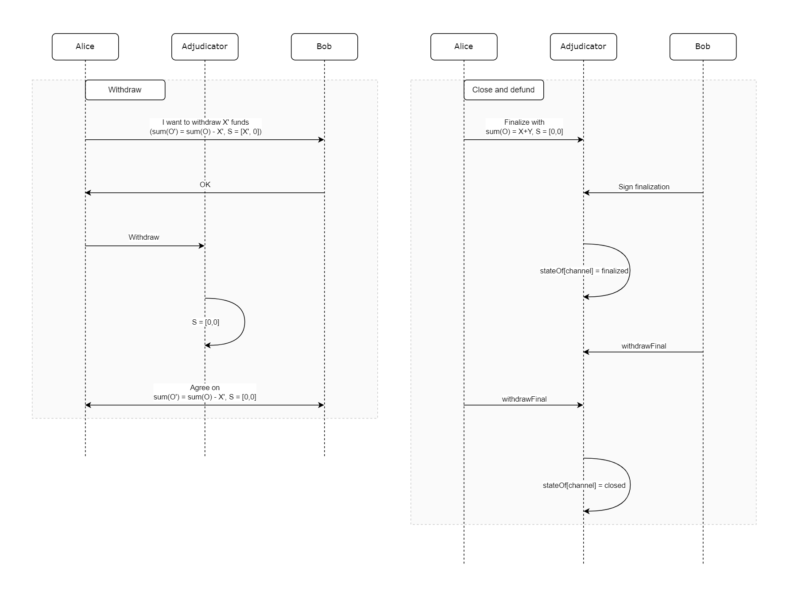

# State channel Protocol

## Preliminaries

This protocol is a modification of statechannels.org's Nitro protocol, which whitepaper can be found [here](https://magmo.com/nitro-protocol.pdf).

We decided to include some details from the original protocol into this doc to better understand how we implement additional features.

### Events

#### ForceMove

---

```solidity
event ChallengeRegistered(
    bytes32 indexed channelId,                    // Unique identifier for a state channel
    uint48 turnNumRecord,                         // A turnNum that (the adjudicator knows) is supported by a signature from each participant
    uint48 finalizesAt,                           // The unix timestamp when `channelId` will finalize
    bool isFinal,                                 // Boolean denoting whether the challenge state is final
    FixedPart fixedPart,                          // Data describing properties of the state channel that do not change with state updates
    IForceMoveApp.VariablePart[] variableParts,   // An ordered array of structs, each decribing the properties of the state channel that may change with each state update
    Signature[] sigs,                             // A list of Signatures that supported the challenge: one for each participant, in participant order (e.g. [sig of participant[0], sig of participant[1], ...])
    uint8[] whoSignedWhat                         // Indexing information to identify which signature was by which participant
);
```

```solidity
event ChallengeCleared(
    bytes32 indexed channelId,      // Unique identifier for a state channel
    uint48 newTurnNumRecord         // A turnNum that (the adjudicator knows) is supported by a signature from each participant
);
```

```solidity
event Concluded(
    bytes32 indexed channelId,      // Unique identifier for a state channel
    uint48 finalizesAt              // The unix timestamp when `channelId` finalized
);
```

---

#### MultiAssetHolder

```solidity
event Deposited(
    bytes32 indexed destination,    // The channel being deposited into
    address asset,                  // The address of asset being deposited (0 means ETH)
    uint256 amountDeposited,        // The amount being deposited
    uint256 destinationHoldings     // The new holdings for `destination`
);
```

---

Indicates the assetOutcome for this channelId and assetIndex has changed due to a transfer or claim. Includes sufficient data to compute:

- the new assetOutcome
- the new holdings for this channelId and any others that were transferred to
- the payouts to external destinations

```solidity
event AllocationUpdated(
    bytes32 indexed channelId,      // The channelId of the funds being withdrawn
    uint256 assetIndex,             // The index of asset, which allocation has been updated, from outcome assets array
    uint256 initialHoldings         // holdings[asset][channelId] **before** the allocations were updated. The asset in question can be inferred from the calldata of the transaction (it might be "all assets")
);
```

### Structures

---

While studying the protocol thoroughly, we made a cheat-sheet for all structures taking part in it:


## Solved attack vectors in the original protocol

| Attack vector | How solved |
| --------------|------------|
| Defund channel to malicious party before it's fully funded | When concluding, all states must be marked as "isFinal: true", parties won't agree on that when opening |
| Finalize channel with obsolete state | 'Challenge duration' period, during which parties can respond with newer state |

## Attack vectors in modified protocol

| Attack vector | How can be solved |
| ------------- | ----------------- |
| Finalize channel and withdraw funds specified in outcome as mine after parties refunded, <br> but I have not (during refunding) | Add "Refunding" channel mode, during which channel can't be finalized <br> OR parties must NOT mark "isFinal: true" in state |
| If funds during refunding are less than what is planned to be iteratively withdrown, <br> withdrawal during refunding could cause not all funds being paid to withdrowing party | Add "Refunding" channel mode, during which funds can't be iteratively withdrown <br> OR add "isWithdrawing: true" to state to iteratively withdraw funds |
| Finalizing channel during withdrawal could cause not all parties to withdraw their funds | Add "Withdrawal" channel mode, during which channel can't be finalized <br> OR parties must mark "isWithdrawin: true" and NOT "isFinal: true" in state |

## Modifications

### Waiting for funding confirmation

---

Usually parties would like to fund a channel in a sequence, waiting for previous ones to deposit funds (this is because the may not trust each other). In a base protocol such an order is guaranteed by adding an additional argument to deposit function:

```solidity
function deposit(
    address asset,          // address of an asset or 0 for ETH
    bytes32 destination,    // channelId
    uint256 expectedHeld,   // how much funds would you expect channel to have before your deposit should be executed
    uint256 amount          // amount of deposit
) public payable
```

These arguments must obey some rules for safety mechanism to work.
From statechannels.org docs:

> There are a few rules to obey when calling `deposit`. Firstly, `destination` must NOT be an external destination. Secondly, the on-chain holdings for `destination` must be greater than or equal to `expectedHeld`. Thirdly, the holdings for `destination` must be less than the sum of the amount expected to be held and the amount declared in the deposit.

> The first rule prevents funds being escrowed against something other than a channelId: funds may only be unlocked from channels, so you shouldn't deposit into anything else. The second rule prevents loss of funds: since holdings are paid out in preferential order, depositing before a counterparty has deposited implies that they can withdraw your funds. The check is performed in the same transaction as the deposit, making this safe even in the event of a chain re-org that reverts a previous participant's deposit. The third rule prevents the deposit of uneccessary funds: if my aim was to increase the holdings to a certain level, but they are already at or above that level, then I want my deposit to transaction revert.

This mechanism guarantees that at the moment of deposit there will be a specified amount of funds already deposited by other parties to the channel. This works for all the parties but the last: no one will call `deposit` function, which will check deposited amount of funds, after him, thus the last party may be malicious and do NOT deposit funds. So how can other parties be sure the last one has deposited?

They can search for *Deposit* event emmited by `deposit` function. But what if a chain reorganizes and the last deposit got excluded from the block?

This situation is extremely rare, but everything has to be 100% secure if we are talking about big money. So, after the last party has deposited, we can wait X number of blocks to be mined and check whether the *Deposit* event is still in the logs of that previous block. If it is, the chain hasn't re-orged, thus all the funds are deposited into the channel and parties can safely start exchanging states.

### Reccuring funding (refunding) and withdrawal

---

Main changes over the base protocol are the support of **refunding** and **reccuring withdrawal** without closing the channel.

> NOTE: In the original protocol "withdraw" happens when defunding channel after agreement on its closure. Instead, we will use the term "withdrawFinal" for that and simply "withdrawal" for reccuring withdrawal, which happens when the channel is opened.

To support those features, additional steps must be added to guarantee security of the protocol. Before refunding and withdrawal all parties must agree on how they want to change the state and the outcome. The same stands for after those operations with funds: parties must agree on what new distribution of funds is.

Overall lifecycle of a channel can be represented as followed:

Open, fund and refund:


Withdraw, close and defund:



### Refunding

---

Refunding process is the same as first funding: firstly all participants have to agree on a new outcome with increased total amount of funds. Then parties deposit to the channel, after which all of them must agree that the channel was refunded. To represent those steps, we added "refunding" channel mode.

### Withdrawal

---

We added channel mode "withdrawal" and renamed "outcome" to "outcomeFinal", while "outcome" is withdrawn during "withdrawal" state.
